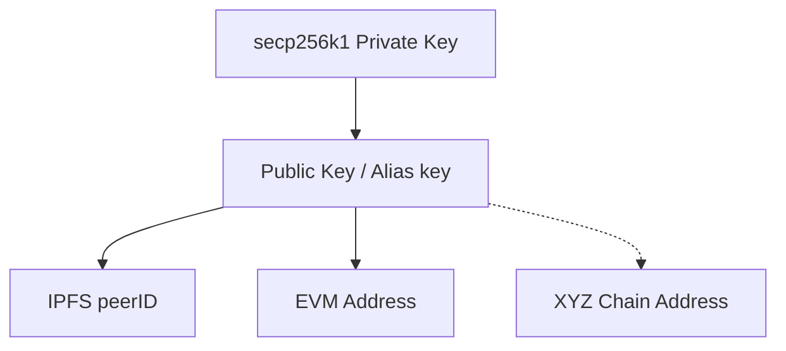

# neuron-go-hedera-sdk (Work In Progress)

## General Concepts

The `neuron-go-hedera-sdk` is a decentralized SDK designed to facilitate peer-to-peer interactions between buyer, seller, and validator agents, leveraging Hedera Hashgraph as a rendezvous mechanism and libp2p for connectivity. The `neuron-go-hedera-sdk` powers the Neuron Network by providing the essential tools to enable decentralized interactions between peers. Its core tenets are:

- **Discover**: Facilitate the discovery of peers, ensuring buyers, sellers, and validators can find each other.
- **Connect**: Enable bidirectional communication channels (streams) between peers, even when they are initially unknown to each other.
- **Pay**: Handle seamless, secure money transfers between data providers (sellers) and data consumers (buyers).
- **Protect**: Allow validators to monitor and verify streams to ensure adherence to a Service License Agreement (SLA) written in business language, all without compromising the privacy of participants.

Below are the key concepts:

### Buyer and Seller (Provider and Consumer)
- **Buyer**: Initiates requests for services or data from sellers. The buyer uses Hedera topics for communication and establishes a P2P stream, an encypted high bandwidth and datarate stream,  for data transfer.
- **Seller**: Responds to requests from buyers, providing the requested service or data. Sellers also use Hedera topics to send payment demands and other messages.
- **Validator**: Ensures the integrity and validity of transactions between buyers and sellers. Validators monitor the Service License Agreement (SLA), ensure compliance, and participate in escrow services.

### Communication Channels
1. **Hedera Topics**:
   - Buyers, sellers, and validators use Hedera topics to exchange messages. These topics serve as public communication channels visible on the Hedera network. Each agent uses following topics
      - stdIn: used by an agent to listen for messages from other peers. These might be service requests, payment demands, complaints, etc. 
      - stdOut: used by an agent to advertise status messages, heartbeats, and general information about its own situation. 
      - stdEr: this is similar to stdOut, but meant for a peer to log error messages about his own situation.
   - Messages include service requests, error notifications, and heartbeat updates.

2. **P2P Streams**:
   - After initial coordination via Hedera, buyers and sellers establish direct P2P streams using libp2p. These streams handle real-time data transfer.

### Explorer
- The **Explorer** can read the public state of the hedera network and assist data consumer in discovering available providers. It queries a list of devices, verifies their availability, and filters based on criteria like location or role.
### Smart Contract
- A **Smart Contract** acts as a decentralized "business directory." It maps roles, topics, and public keys to their respective entities and links Service Licence Agreements to pricing information.  This contract ensures discoverability. 

### Service License Agreement (SLA)
- The SLA defines the terms of service between buyers and sellers. Validators verify that SLAs are adhered to during interactions, ensuring trust and compliance. SLAs are hardcoded while in Beta

### Payments
- Payments occur in the background, facilitated by shared accounts on Hedera. Buyers deposit funds into shared accounts, and sellers initiate scheduled transfers to claim payment. Validators ensure payment terms are met as per the SLA.

## Identifiers  keys and acconts. 

The SDK utilizes several types of addresses, most of which operate transparently in the background. However, the most significant identifier is the **secp256k1 private key**, as depicted in the diagram. This private key is foundational, deriving the **public key**, which also serves as the Hedera identifier. This design is preferred over conventional Hedera account identifiers to facilitate cross-chain compatibility in the future.

From the public key, we derive **peer IDs**, which are IPFS-compatible addresses used for direct peer-to-peer (P2P) communication. Similarly, other addresses, such as **EVM addresses** or identifiers for other blockchains (e.g., XYZ chain), are also derived, ensuring the system remains flexible and interoperable with various networks.


### Accounts

A peer in the Neuron network requires two Hedera accounts: a **parent account** and a **device account**. These accounts are linked by a parent-child relationship, but only the device account is explicitly used by the SDK. 

The **device account** must have three associated topics:
- **stdIn**: For receiving requests and communications from other peers.
- **stdOut**: For advertising status messages, heartbeats, and general updates.
- **stdErr**: For logging and reporting errors.

Device accounts are meant to hold just enough tokens to send and receive public HCS messages, while parent accounts are meant to receive data payments.

Additionally, the device account's EVM address is recorded in the smart contract, along with its topics and payment-related information.

> **Do this first:**  
> The quickest way to create a new Hedera account and register it in the Neuron smart contract is by visiting [explorer.neuron.world](https://explorer.neuron.world).

## Compiling

To build the `neuron-go-hedera-sdk`, you need to ensure that you have the latest version of Go installed. You can download and install it from [the official golang site](https://go.dev/dl/)

### Steps to Build the SDK

1. **Clone the Repository**:
   Clone the SDK repository to your local system:

      ```bash
      git clone https://github.com/NeronInnovations/neuron-go-hedera-sdk.git
      cd neuron-go-hedera-sdk
      ```

2.	**Install Dependencies**: 
      Use go mod to download the required dependencies:
      ```bash 
      go mod tidy
      ```
3.	Build the SDK:
      Run the following command to build the SDK:
      ```bash
      go build -o neuron-sdk
      ```
      This will generate an executable file named neuron-sdk in the current directory.

## Running Your First DApp - Hello World
> **Do this first:**  
> Get test net keys by registering with [explorer.neuron.world](https://explorer.neuron.world); alternatively, if you know what you're doing, create the keys yourself.


To write a minimal decentralized application (DApp) using the `neuron-go-hedera-sdk`, you'll need to set up an environment file (`.env`) and understand the command-line flags required to run it. The `.env` file contains essential information such as keys, Hedera chain configuration (e.g., testnet), and other variables. Additionally, you'll need to be familiar with the runtime flags that configure the SDK's behavior.

In this section, we will guide you through:

1. Filling out the environment template to create your `.env` file.
2. Writing a simple "Hello World" program that includes the SDK.
3. Breaking down the components of the main program to understand how it works.
4. Running the program with the appropriate command-line parameters.

Let's get started by creating your `.env` file. Create a folder and place the a file named `.env` at the root. 
```properties
private_key=
hedera_evm_id=
hedera_id=
location=
list_of_sellers=
eth_rpc_url=https://testnet.hashio.io/api
mirror_api_url=https://testnet.mirrornode.hedera.com/api/v1
neuron_explorer_url=https://explorer.neuron.world/api/v1/device/wip-all
smart_contract_address=0x87e2fc64dc1eae07300c2fc50d6700549e1632ca
```

Below is an explanation of the environment variables required for the `neuron-go-hedera-sdk`. These variables should be defined in a `.env` file to configure your application.

#### Required Environment Variables:

1. **`eth_rpc_url`**:
   - **Description**: URL of the Ethereum-compatible JSON-RPC endpoint for Hedera.
   - **Example**: `https://testnet.hashio.io/api`
   - **Purpose**: Enables the SDK to interact with Hedera's EVM layer for operations such as querying accounts.

2. **`private_key`**:
   - **Description**: Your private key in hexadecimal format. Use an secp256k1 (not DER)
   - **Example**: `83c386a507ec1de...`
   - **Purpose**: Used to sign transactions and authenticate the device account.

3. **`hedera_evm_id`**:
   - **Description**: The EVM-compatible address of your Hedera device account.
   - **Example**: `20ad40c4b874...`
   - **Purpose**: Serves as an identifier for the device account on the Hedera network.

4. **`hedera_id`**:
   - **Description**: The Hedera Account ID of your device. 
   - **Example**: `0.0.1234`
   - **Purpose**: Used by Hedera APIs to identify the account associated with your device.

5. **`location`**:
   - **Description**: The approximate geographic location of your device in JSON format.
   - **Example**: `{"lat":50.1,"lon":1.8898,"alt":0.000000}`
   - **Purpose**: Helps buyers filter sellers based on geographic proximity.

6. **`list_of_sellers`**:
   - **Description**: A comma-separated list of seller public keys or peer IDs.
   - **Example**: `021789142f21495d9d3a4102fe9b21d30d4705b56272f011fa00e0ae8dce3a4751`
   - **Purpose**: Specifies named sellers that the buyer can directly interact with.

7. **`mirror_api_url`**:
   - **Description**: The API endpoint of the Hedera Mirror Node.
   - **Fixed Value**: `https://testnet.mirrornode.hedera.com/api/v1`
   - **Purpose**: Enables the SDK to query historical and real-time Hedera network data.

8. **`neuron_explorer_url`**:
   - **Description**: The API endpoint of the Neuron Explorer.
   - **Fixed Value**: `https://explorer.neuron.world/api/v1/device/wip-all`
   - **Purpose**: Used to discover available devices (peers) and their metadata.

9. **`smart_contract_address`**:
   - **Description**: The EVM-compatible address of the Neuron smart contract.
   - **Fixed Value**: `0x87e2fc64dc1eae07300c2fc50d6700549e1632ca`
   - **Purpose**: Used for interactions with the smart contract, such as registering devices or querying SLA information.

#### Optional/Derived Information:
- The `list_of_sellers` is only useful for data buyers and can be left empty if discovery is handled dynamically (see flags section)

### Minimal Main Program Example

To use the sdk you implement callbacks for the `LaunchSDK` function.  T

```go
neuronsdk.LaunchSDK(
		"0.1" // Specify your app's version
		NrnProtocol, // Specify a protocol ID
		func(envIsReady chan bool, envFile string) error {
         // Define custom key configurator logic or leave empty
        },         
		
      
      
        func(ctx context.Context, h host.Host, b *commonlib.NodeBuffers) { 
         // Define buyer case logic here (if required)
		},
		func(msg hedera.TopicMessage) { 
         // Define buyer topic callback logic here (if required)
		},


		func(ctx context.Context, h host.Host, b *commonlib.NodeBuffers) { 
         // Define seller case logic here (if required)
		},
		func(msg hedera.TopicMessage) {
			// Define seller topic callback logic here (if required)
		}
)

```
The first parameter is the protocol ID you will use. This should align with the SLA that your dapp will adhere to. The first callback alllows you to define a custom key configurator; this can be an UI or any other means to capture the users private key. Note private keys are not encrypted for the time being.  The next pair of call backs are to define the buyer logic of your dapp; one to interact with other peers in a p2p fashion and the other one to receive messages sent to the peer's `stdIn` topic; you receive here messages that the core SDK can't handle and thus are deemed dapp-level messages.  The next pair is the same but for the seller case. 


Below is a minimal example of a `main.go` file that demonstrates how to import the `neuron-go-hedera-sdk`, handle flags, and launch the SDK using its core `LaunchSDK` function. The data seller in this example is simply sending the text "ping" repeateadly to whoever is connected to him / buying data from him. 

```go
// main.go
package main

import (
	"bufio"
	"context"
	"fmt"
	"log"
	neuronsdk "neuron/sdk" // Import neuronFactory from neuron-go-sdk
	commonlib "neuron/sdk/common-lib"
	hedera_msg "neuron/sdk/hedera"
	"time"

	"github.com/hashgraph/hedera-sdk-go/v2"
	"github.com/libp2p/go-libp2p/core/host"
	"github.com/libp2p/go-libp2p/core/network"
	"github.com/libp2p/go-libp2p/core/protocol"
)
)

func main2() {

	var NrnProtocol = protocol.ID("/nrn-mydapp/v1")

	neuronsdk.LaunchSDK(
               "0.1" // Specify your app's version
		NrnProtocol, // Specify a protocol ID
		nil,         // leave nil if you don't need custom key configuration logic
		func(ctx context.Context, h host.Host, b *commonlib.NodeBuffers) { // Define buyer case logic here (if required)
			h.SetStreamHandler(NrnProtocol, func(streamHandler network.Stream) {
				defer streamHandler.Close()
				// I am receiving data from the following peer
				peerID := streamHandler.Conn().RemotePeer()
				b.SetStreamHandler(peerID, &streamHandler)
				streamReader := bufio.NewReader(streamHandler)
				// print ping messages to the screen while the other side sends data
				for {
					isStreamClosed := network.Stream.Conn(streamHandler).IsClosed()
					if isStreamClosed {
						log.Println("Stream seems to be closed ...", peerID)
						break
					}
					bytesFromOtherside, err := streamReader.ReadBytes('\n')
					if err != nil {
					}
					fmt.Print("Received from ", peerID, ":", string(bytesFromOtherside))

				}
			})

		},
		func(msg hedera.TopicMessage) { // Define buyer topic callback logic here (if required)
		},
		func(ctx context.Context, h host.Host, b *commonlib.NodeBuffers) { // Define seller case logic here (if required)
			// every 10 seconds, send a ping message
			for {
				// for each connected buyer peer, send a ping message
				for peerID, bufferInfo := range b.GetBufferMap() {
					// send the private and encrypted message using the p2p streem
					sendError := commonlib.WriteAndFlushBuffer(*bufferInfo, peerID, b, []byte("ping"))
					if sendError != nil {
						//send the public connectivity error message for the other peer's sdk to handle
						hedera_msg.PeerSendErrorMessage(
							bufferInfo.RequestOrResponse.OtherStdInTopic,
							commonlib.WriteError, fmt.Sprintf("Are you online, I cannot write to you:%s", sendError),
							commonlib.SendFreshHederaRequest,
						)
						continue
					}
				}
				time.Sleep(10 * time.Second)
			}

		},
		func(msg hedera.TopicMessage) {
			// Define seller topic callback logic here (if required)
		},
	)
}
```

Notice that in the example above we define all the behaviour of the dapp at once; soon, we'll add the callback for the validator logic here too. However, the application will run in only one mode: either buyer or seller. The mode of operation can be handled by the flags defined next. 

### Flags Reference

The `neuron-go-hedera-sdk` supports the following command-line flags for configuring its behavior:

#### General Flags

1. **`--mode`**
   - **Description**: Specifies whether the node should operate in "peer" mode (for regular P2P communication) or "relay" mode (to relay traffic for other peers).
   - **Default**: `peer`
   - **Example**: `--mode=peer`

2. **`--force-protocol`**
   - **Description**: Forces the application to use a specific network protocol.
   - **Options**: `udp`, `tcp` (only `udp` and `QUIC` are supported at the moment).
   - **Default**: `udp`
   - **Example**: `--force-protocol=udp`

3. **`--port`**
   - **Description**: Specifies the port the node should bind its listener to.
   - **Default**: `0` (random port) // note random port doesn't work at the moment
   - **Example**: `--port=9000`

4. **`--enable-upnp`**
   - **Description**: Enables Universal Plug and Play (UPnP) to automatically forward ports on supported routers, making the node more accessible.
   - **Default**: `false`
   - **Example**: `--enable-upnp`

5. **`--force-location`**
   - **Description**: Overrides the node's location using a JSON struct in the format: `{"lat": <latitude>, "lon": <longitude>, "alt": <altitude>}`.
   - **Default**: Not set (uses location from the environment file if available).
   - **Example**: `--force-location={"lat":50.1,"lon":1.8898,"alt":0.000000}`

6. **`--buyer-or-seller`**
   - **Description**: Specifies whether the node is operating as a "buyer" (data requester) or "seller" (data provider).
   - **Default**: Not set (must be explicitly defined).
   - **Example**: `--buyer-or-seller=buyer`

7. **`--my-public-ip`**
   - **Description**: Manually sets the public IP address of the node. Useful if automatic detection fails or a specific IP is required.
   - **Default**: Not set
   - **Example**: `--my-public-ip=192.168.1.100`

8. **`--my-public-port`**
   - **Description**: Manually sets the public port of the node. Useful for specifying externally mapped ports in NAT or firewall scenarios.
   - **Default**: Not set
   - **Example**: `--my-public-port=9000`

#### Buyer-Specific Flags

1. **`--list-of-sellers-source`**
   - **Description**: Specifies the source for obtaining the list of sellers. If 'env' is set the the sellers need to be named in the "list_of_sellers" environment file line. 
   - **Options**: 
     - `explorer`: Fetch from an external service.
     - `env`: Fetch from the environment variables.
   - **Default**: `explorer`
   - **Example**: `--list-of-sellers-source=explorer`

2. **`--radius`**
   - **Description**: Used when "explorer" is selected and specifies the radius (in kilometers) to restrict seller nodes based on their latitude and longitude.
   - **Default**: `1` (1 km radius)
   - **Example**: `--radius=10`

   To run the previous example in buyer mode do
   ```bash
      go build -o mydapp
      ./mydapp --mode=peer --buyer-or-seller=buyer --port=30088  --list-of-sellers-source=env
   ```

   To run the program as a seller, you will need a separate environment file (e.g., .env-seller) to specify the seller’s keys and configuration. The --envFile flag allows you to explicitly define which environment file to use for each instance.

   This setup makes it convenient to run both buyer and seller instances on the same machine for testing purposes. Simply specify a different --envFile value and ensure other parameters (like --port) do not conflict. This approach ensures that you can simulate both roles without any overlaps or configuration issues.          
   ```bash
      go build -o mydapp
      ./mydapp --mode=peer --buyer-or-seller=seller --envFile=.env-seller --port=20088 
   ```

