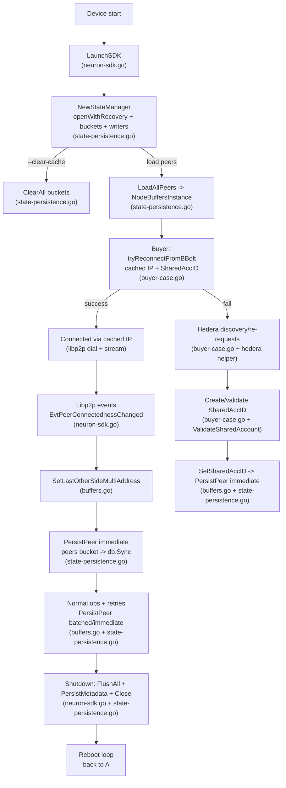

# BBolt Flow for Persisting IPs and Shared Accounts

This document traces how the SDK stores and reloads peer IP addresses and shared account IDs in bbolt so nodes can reconnect after a reboot without requerying Hedera.

## Data Model and Buckets

- Database: bbolt at `~/.neuron/state.db` by default (`common-lib/state-persistence.go`).
- Buckets: `peers`, `topics`, `metadata` (`common-lib/state-persistence.go`).
- Stored payload: JSON-serialized `NodeBufferInfo` under `peers` keyed by `peer.ID`. Fields include `LastOtherSideMultiAddress` (persisted IP multiaddrs), `SharedAccID` and `SharedAccIDCreatedAt`, connection state, rendezvous state, and retry counters (`common-lib/buffers.go`, `common-lib/state-types.go`).

## Startup and Load Path (ordered calls)

1. `LaunchSDK` resolves DB path and calls `NewStateManager` (`neuron-sdk.go`).
2. `NewStateManager` -> `openWithRecovery` opens/recovers the DB -> `initializeBuckets` creates `peers/topics/metadata` buckets -> starts `batchWriter` and `immediateWriter` goroutines (`common-lib/state-persistence.go`).
3. If `--clear-cache` is set, `ClearAll` recreates buckets; otherwise `LoadAllPeers` iterates the `peers` bucket, deserializes `NodeBufferInfo`, and hydrates `NodeBuffersInstance` (`common-lib/state-persistence.go`).
4. Hydrated buffers carry `LastOtherSideMultiAddress` and `SharedAccID`, enabling cached reconnects before any Hedera query.
5. If DB open/initialize fails, `degradedMode=true`, writers stay running but writes are dropped until recovery.

## Write Triggers (what gets persisted and when)

- IP changes: `NodeBuffers.SetLastOtherSideMultiAddress` updates `LastOtherSideMultiAddress` and calls `PersistPeer(..., immediate=true)` (`common-lib/buffers.go`).
- Shared account creation/reuse: `NodeBuffers.SetSharedAccID` records `SharedAccID` and creation time, persisted immediately (`common-lib/buffers.go`).
- Connection state and retries: `UpdateBufferLibP2PState`, `IncrementReconnectAttempts`, and buffer creation helpers call `PersistPeer` (immediate for critical states, batched otherwise).
- P2P events: In `LaunchSDK`, `EvtPeerConnectednessChanged` captures the remote multiaddr on connect, writes it into the buffer, and persists immediately. Identification events are persisted in batched mode (`neuron-sdk.go`).
- Beetle writes: Immediate writes sync to disk (`db.Sync()`), ensuring IPs and SharedAccIDs survive power loss. Batched writes flush on interval or queue pressure.

## Serialization Details

- `SerializeNodeBufferInfo`/`DeserializeNodeBufferInfo` convert buffers to JSON for bbolt (`common-lib/state-types.go`). Deserialization also attempts to migrate `SharedAccID` from legacy envelopes if the dedicated field is empty.

## Reconnect Flow After Reboot (ordered operations)

1. Buffers hydrated from bbolt (see Startup).
2. Buyer startup runs `tryReconnectFromBBolt` before hitting Hedera (`buyer-case.go`). Sequence per peer:  
   a) Require both `LastOtherSideMultiAddress` and `SharedAccID`; otherwise skip to Hedera.  
   b) Split multiaddrs, build `peer.AddrInfo`, and attempt `p2pHost.Connect` with timeout.  
   c) On success, mark `Connected`, optionally open a stream for verification, and return.
3. If all cached attempts fail, normal Hedera discovery/resend path runs.

## Shared Account Reuse Path

- When preparing a new request, `processSeller` attempts to reuse persisted `SharedAccID` by loading the peer from bbolt (`StateManager.LoadPeer`). It validates the ID via `ValidateSharedAccount` before reuse (`dapp-protocols/stream-buyer-vs-seller/buyer-case.go`).
- If connected via hole punching but `SharedAccID` is missing, the code creates one asynchronously, stores it with `SetSharedAccID`, and persists immediately.

## Additional Persist Points in Buyer Flow

- Hole punching success: stores the successful IP, ensures a buffer exists, and immediately persists to bbolt (`performBuyerHolePunching` in `buyer-case.go`).
- Hedera request send path: when constructing envelopes, the derived `SharedAccID` is stored and persisted via `SetSharedAccID` for future reuses without extra Hedera cost.

## Shutdown Behavior

- `LaunchSDK` defers a shutdown block that calls `FlushAll`, writes metadata (e.g., `last_shutdown`), and closes the database. Flush drains both batched and immediate queues and syncs the DB to disk.

## Failure and Recovery

- If bbolt open/initialize fails, StateManager marks degraded mode, drops writes, and periodically retries opening the DB (`retryDatabaseOpen`). Corruption triggers backup of the bad file and recreation of a clean DB (`openWithRecovery`).

## End-to-End Operation Sequence with Code Touchpoints

1. **Device/SKD startup**

   - Flags/env loaded, NAT info gathered (`neuron-sdk.go`).
   - `LaunchSDK` resolves DB path and creates `StateManager`; this opens bbolt with recovery and starts writer goroutines (`common-lib/state-persistence.go`).
   - If `--clear-cache` is set, `ClearAll` wipes buckets; otherwise `LoadAllPeers` hydrates `NodeBuffersInstance` with previously persisted buffers (including IPs and SharedAccIDs).

2. **Immediate post-boot reconnection (before Hedera)**

   - Buyer flow calls `tryReconnectFromBBolt` as the first reconnection attempt (`buyer-case.go`).
   - For each persisted peer having both `LastOtherSideMultiAddress` and `SharedAccID`, it parses cached multiaddrs, dials with `p2pHost.Connect`, and opens a stream to confirm. Success updates in-memory state to `Connected`; on failure it falls back to Hedera-driven discovery.

3. **Live connection and IP capture**

   - When libp2p emits `EvtPeerConnectednessChanged` with `Connected`, the code ensures a buffer exists (creates via `AddBuffer3` if missing), reads the remote multiaddr, calls `SetLastOtherSideMultiAddress`, then `PersistPeer(..., immediate=true)` (`neuron-sdk.go`, `common-lib/buffers.go`).
   - Identification events (`EvtPeerIdentificationCompleted`) are persisted in batched mode to avoid churn.

4. **Shared account lifecycle**

   - When a service envelope is created (Hedera request), `extractSharedAccIDFromEnvelope` retrieves the new ID; `SetSharedAccID` records it and triggers an immediate persist (`common-lib/buffers.go`).
   - When reusing an account, `processSeller` loads the peer from bbolt via `LoadPeer`, validates with `ValidateSharedAccount`, and reuses the ID without re-creation (`buyer-case.go`). If invalid or missing, a new ID is generated, stored, and persisted.

5. **Write pipeline internals**

   - `PersistPeer` enqueues writes to `immediateQueue` (critical) or `writeQueue` (batched).
   - `immediateWriter` wraps each write in a single `db.Update` and calls `db.Sync()` for durability.
   - `batchWriter` accumulates up to `defaultBatchSize` or `defaultBatchInterval` and executes them in one transaction.
   - `executeWriteInTx` routes by type (`PeerWrite`, `TopicPositionWrite`, `MetadataWrite`) into the correct bucket. Payload is JSON from `SerializeNodeBufferInfo` (`common-lib/state-types.go`).

6. **Ongoing updates while running**

   - Retry/backoff counters (`IncrementReconnectAttempts`), state changes (`UpdateBufferLibP2PState`), and IP/SharedAccID updates all call `PersistPeer` with appropriate immediacy.
   - Hole-punch success path stores the working address, ensures a buffer exists, and immediately persists (`performBuyerHolePunching` in `buyer-case.go`).

7. **Shutdown durability**

   - Deferred block in `LaunchSDK` calls `FlushAll` (drains queues and executes pending writes), `PersistMetadata("last_shutdown", ...)`, then `Close` to sync and close the DB (`neuron-sdk.go`, `common-lib/state-persistence.go`).

8. **Reboot and reconnect**
   - After reboot, steps 1–2 rehydrate buffers from bbolt, run BBolt-first reconnect, and only then fall back to Hedera rediscovery. Persisted IPs and SharedAccIDs make reconnection mostly local and wallet-cheap.

## Key Code Snippets (trimmed for clarity)

**Capture and persist remote IP on connect** (`neuron-sdk.go`)

```go
case event.EvtPeerConnectednessChanged:
    if e.Connectedness == network.Connected && GlobalStateManager != nil && NodeBuffersInstance != nil {
        bufferInfo, exists := NodeBuffersInstance.GetBuffer(e.Peer)
        if !exists {
            NodeBuffersInstance.AddBuffer3(e.Peer, types.ReceivedOK, types.Connected)
            bufferInfo, _ = NodeBuffersInstance.GetBuffer(e.Peer)
        }
        if conns := p2pHost.Network().ConnsToPeer(e.Peer); len(conns) > 0 {
            remoteAddr := conns[0].RemoteMultiaddr().String()
            NodeBuffersInstance.SetLastOtherSideMultiAddress(e.Peer, remoteAddr)
            bufferInfo, _ = NodeBuffersInstance.GetBuffer(e.Peer)
        }
        GlobalStateManager.PersistPeer(e.Peer, bufferInfo, true) // immediate + Sync
    }
```

**Write pipeline (immediate path)** (`common-lib/state-persistence.go`)

```go
func (sm *StateManager) immediateWriter() {
    for {
        select {
        case write := <-sm.immediateQueue:
            if err := sm.executeWrite(write); err != nil { log.Printf("Immediate write failed: %v", err) }
        case <-sm.stopChan:
            return
        }
    }
}

func (sm *StateManager) executeWrite(write interface{}) error {
    err := sm.db.Update(func(tx *bolt.Tx) error { return sm.executeWriteInTx(tx, write) })
    if err != nil { return err }
    return sm.db.Sync() // durability for crit writes
}

func (sm *StateManager) executeWriteInTx(tx *bolt.Tx, write interface{}) error {
    switch w := write.(type) {
    case PeerWrite:
        data, _ := SerializeNodeBufferInfo(w.Info)
        return tx.Bucket([]byte(bucketPeers)).Put([]byte(w.PeerID.String()), data)
    // topics/metadata omitted
    default:
        return fmt.Errorf("unknown write type: %T", write)
    }
}
```

**SharedAccID capture and persist** (`common-lib/buffers.go`)

```go
func (nb *NodeBuffers) SetSharedAccID(peerID peer.ID, sharedAccID uint64) {
    nb.mu.Lock()
    defer nb.mu.Unlock()
    if buffer, ok := nb.Buffers[peerID]; ok {
        buffer.SharedAccID = sharedAccID
        buffer.SharedAccIDCreatedAt = time.Now()
        if GlobalStateManager != nil {
            GlobalStateManager.PersistPeer(peerID, buffer, true) // immediate
        }
    }
}
```

**BBolt-first reconnect** (`buyer-case.go`)

```go
func tryReconnectFromBBolt(ctx context.Context, p2pHost host.Host, sellerBuffers *commonlib.NodeBuffers, protocol protocol.ID) {
    for peerID, buffer := range sellerBuffers.Buffers {
        if buffer.LastOtherSideMultiAddress == "" || buffer.SharedAccID == 0 { continue }
        sellerIPs := strings.Fields(buffer.LastOtherSideMultiAddress)
        go func(peerID peer.ID, ips []string, sharedAccID uint64) {
            for _, ipStr := range ips {
                addr, err := multiaddr.NewMultiaddr(ipStr); if err != nil { continue }
                connectCtx, cancel := context.WithTimeout(ctx, 10*time.Second); defer cancel()
                err = p2pHost.Connect(connectCtx, peer.AddrInfo{ID: peerID, Addrs: []multiaddr.Multiaddr{addr}})
                if err == nil {
                    sellerBuffers.UpdateBufferLibP2PState(peerID, types.Connected)
                    if stream, err := p2pHost.NewStream(context.Background(), peerID, protocol); err == nil { stream.Close(); return }
                }
            }
        }(peerID, sellerIPs, buffer.SharedAccID)
    }
}
```

## Lifecycle Diagram (high level)



### What each step touches in code

- **A→B (Device start → LaunchSDK)**: Entry in `neuron-sdk.go` sets up flags/env, NAT info, and calls `LaunchSDK`.
- **B→C (NewStateManager)**: `common-lib/state-persistence.go` opens bbolt (`openWithRecovery`), initializes buckets, and starts `batchWriter`/`immediateWriter`.
- **C→D/E (Clear vs Load)**: `ClearAll` wipes buckets; `LoadAllPeers` hydrates `NodeBuffersInstance` from `peers` bucket.
- **E→F (tryReconnectFromBBolt)**: `buyer-case.go` uses cached `LastOtherSideMultiAddress` + `SharedAccID` to dial peers before any Hedera calls.
- **F outcomes**: Success keeps things local; failure routes to Hedera topic/SC discovery.
- **G→J→K (IP capture and persistence)**: Libp2p event handler in `neuron-sdk.go` ensures a buffer, captures `RemoteMultiaddr`, calls `SetLastOtherSideMultiAddress` and `PersistPeer` (immediate) -> `executeWriteInTx` -> `peers` bucket -> `db.Sync()`.
- **H→L→M (SharedAccID creation/validation/persist)**: `processSeller` validates persisted IDs via `LoadPeer` + `ValidateSharedAccount`; `SetSharedAccID` persists immediately to `peers`.
- **N (Normal ops + retries)**: `UpdateBufferLibP2PState`, `IncrementReconnectAttempts`, and hole-punch success keep buffers updated and persisted (immediate or batched) while running.
- **O (Shutdown durability)**: Deferred block in `neuron-sdk.go` calls `FlushAll`, `PersistMetadata("last_shutdown", ...)`, then `Close` to sync and close bbolt.
- **P (Reboot loop)**: After restart, the same path rehydrates buffers and attempts BBolt-first reconnect, making reconnection fast and cheap.

---

## 🔍 Database Verification and Testing Guide

### Quick Verification Methods

#### 1. Command Line Database Inspection

```bash
# Install bbolt CLI tool
go install go.etcd.io/bbolt/cmd/bbolt@latest

# View database buckets (default location: ~/.neuron/state.db)
bbolt buckets ~/.neuron/state.db

# List all peer IDs in the peers bucket
bbolt keys ~/.neuron/state.db peers

# View database statistics
bbolt info ~/.neuron/state.db

# Inspect a specific peer's data
bbolt get ~/.neuron/state.db peers <peer_id_hex> | xxd -r | jq .
```

### Database Schema Inspection

#### Bucket Structure

```bash
# Expected buckets:
# - peers: Stores NodeBufferInfo JSON keyed by peer.ID
# - topics: Stores topic message positions
# - metadata: Stores system metadata

bbolt buckets ~/.neuron/state.db
# Output should show:
# peers
# topics
# metadata
```

#### Peer Data Format

```bash
# View raw peer data (replace <peer_id> with actual peer ID)
bbolt get ~/.neuron/state.db peers <peer_id> | xxd -r

# Expected JSON structure:
{
  "LastOtherSideMultiAddress": "/ip4/192.168.1.100/tcp/8080",
  "LibP2PState": "Connected",
  "RendezvousState": "SendOK",
  "IsOtherSideValidAccount": true,
  "NoOfConnectionAttempts": 3,
  "SharedAccID": 12345,
  "SharedAccIDCreatedAt": "2024-01-15T10:30:00Z",
  "LastConnectionAttempt": "2024-01-15T10:35:00Z",
  "NextScheduledConnectionAttempt": "2024-01-15T10:40:00Z"
}
```
