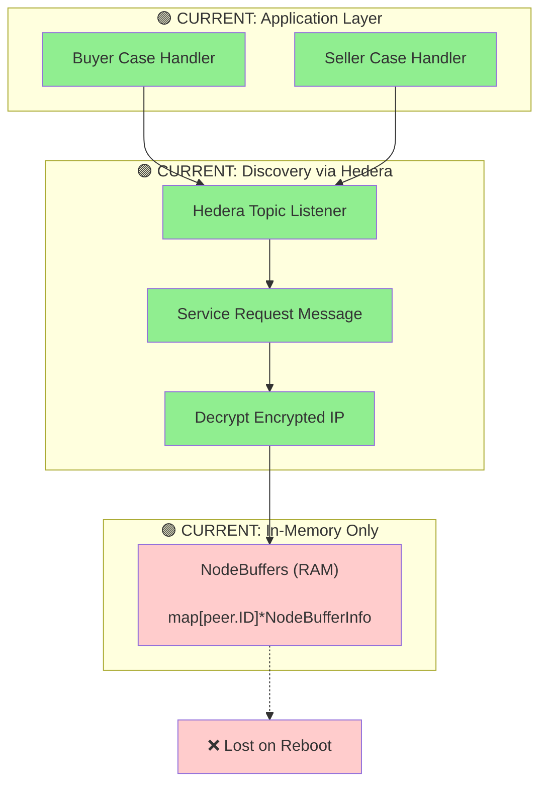
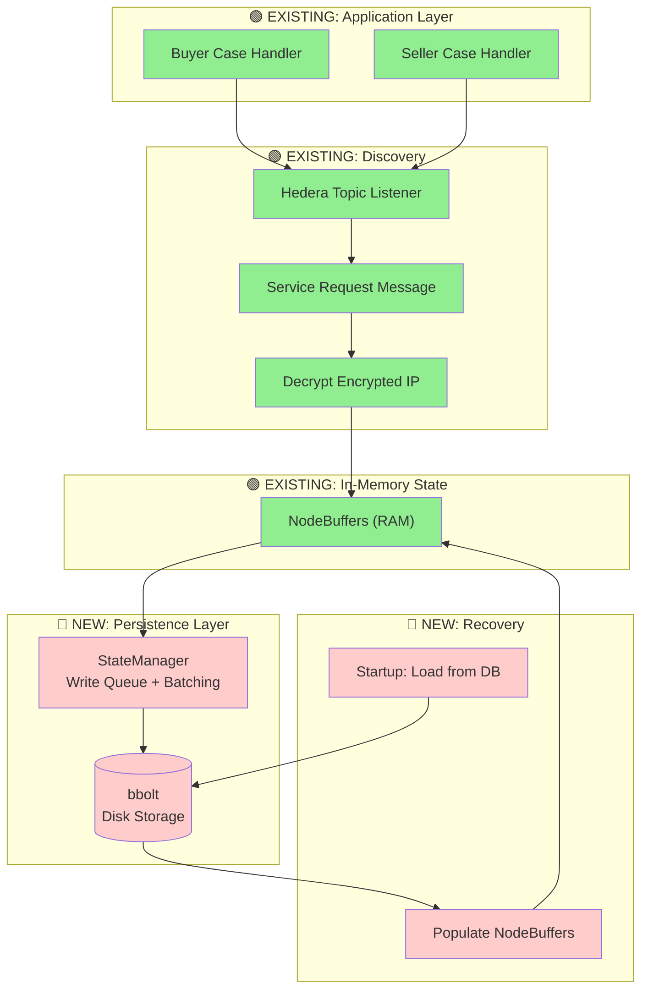
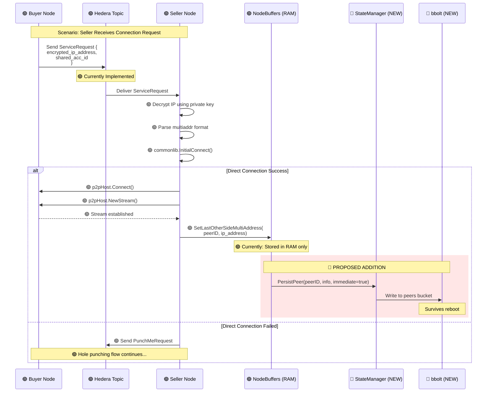
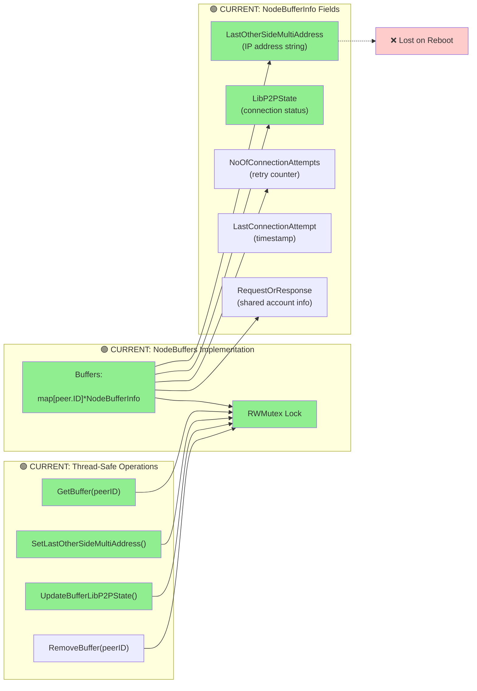
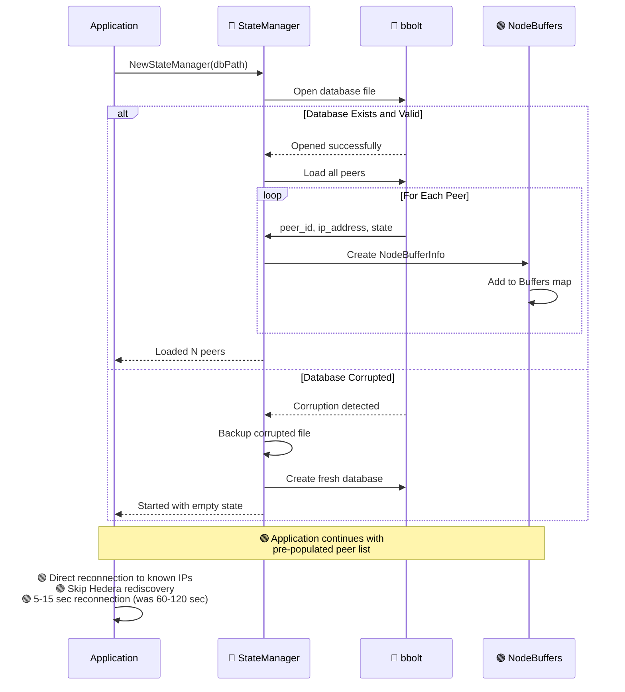

# IP Address Persistent Storage - Proposed Architecture

---

## IMPORTANT NOTICE

**Document Purpose**: This document illustrates the **PROPOSED architecture** for implementing persistent state management in the neuron-go-hedera-sdk using **bbolt** (maintained fork of BoltDB).

### Database Technology Note

This proposal uses **bbolt** (`go.etcd.io/bbolt`):
- Maintained fork of the original BoltDB (which was archived in 2017)
- Actively maintained by the etcd/CNCF team
- Production-proven (powers Kubernetes via etcd)
- API-compatible with original BoltDB but with bug fixes and improvements
- Latest stable release with security updates

### Current State (Without This Implementation)

The SDK currently operates **WITHOUT persistent storage**:
- IP addresses are stored **only in memory**
- Connection state is **lost on device reboot**
- Hedera topic positions **reset** after restart
- Devices must **rediscover all peers** via expensive Hedera queries
- **Reconnection takes 60-120 seconds** per peer after reboot

### Proposed State (With This Implementation)

After implementing the persistence layer described in this document:
- IP addresses **persist across reboots**
- Connection state **survives device restarts**
- Hedera topics **resume from last position**
- Devices **reconnect directly** to known IPs
- **Reconnection takes 5-15 seconds** (80% faster)

### Visual Legend

Throughout this document:
- 🟢 **GREEN components**: Currently implemented in the SDK
- 🟡 **YELLOW components**: Partially implemented
- 🔴 **RED components**: Proposed additions (not yet implemented)

---

## Problem Statement

### Current System Behavior

```
Device Boot → Load SDK → Empty State → Listen to Hedera Topics
                                     ↓
                            Wait for sellers to advertise
                                     ↓
                            Decrypt IPs from messages
                                     ↓
                            Attempt connections
                                     ↓
                            Store IPs in RAM only
                                     ↓
Device Reboot → ALL STATE LOST → Start over (60-120 sec delay)
```

### Proposed System Behavior

```
Device Boot → Load SDK → Open Database → Load Persisted IPs
                                     ↓
                            Direct reconnection to known peers
                                     ↓
                            Connected in 5-15 seconds
                                     ↓
Device Reboot → State preserved → Fast reconnection
```

### Reconnection Comparison: Current vs Proposed

| Scenario | Current System (No bbolt) | Proposed System (With bbolt) | Improvement |
|----------|---------------------------|------------------------------|-------------|
| **After Device Reboot** | Buffer empty → **Always** Full Hedera Discovery | Buffer loaded from DB → **Usually** Direct Reconnect | ⚡ 80% faster |
| **Reconnection Time** | 60-120 seconds per peer | 5-15 seconds per peer | ⏱️ 10x faster |
| **Hedera Queries** | Every reconnection | Only when IP changes (~5% of time) | 💰 95% cost reduction |
| **IP Address Cached** | ❌ No (lost on reboot) | ✅ Yes (persisted in bbolt) | ✅ Persistent |
| **Fallback Mechanism** | N/A (always Hedera) | Falls back to Hedera if cached IP stale | 🛡️ Resilient |
| **State Persistence** | ❌ None | ✅ Automatic (async batching) | 📀 ~23 writes/hour |

**Key Insight**: With bbolt, "Full Rediscovery via Hedera" becomes a **rare fallback** (5% of reconnections) instead of the **default path** (100% of reconnections).

---

## 1. System Architecture Overview

### Current System (Stateless)



### Proposed System (With Persistence)



---

## 2. Detailed IP Discovery and Storage Flow

This sequence shows how the proposed system will handle IP address discovery and persistence.

**Legend**:
- 🟢 Green boxes: Current functionality
- 🔴 Red boxes: Proposed additions



---

## 3. Current In-Memory State Management

This diagram shows the **existing** NodeBuffers structure that stores state in RAM.



**Source Code References** (common-lib/buffers.go):
- Line 34-44: NodeBuffers structure
- Line 89-101: NodeBufferInfo fields
- Line 223-230: SetLastOtherSideMultiAddress()
- Line 160-170: UpdateBufferLibP2PState()

---

## 4. Proposed: Adding Persistence Layer

This shows the **new components** that will be added.

```mermaid
graph TB
    subgraph "🟢 EXISTING: Application Events"
        AppUpdate[SetLastOtherSideMultiAddress
        UpdateBufferLibP2PState
        AddBuffer2]
        EventBus[libp2p Event Bus
        EvtPeerConnectednessChanged
        EvtPeerIdentificationCompleted]
    end

    subgraph "🔴 NEW: Event Classification"
        Classify{Event Type?}
        Critical[Critical Event
        - New connection
        - IP discovered
        - Connection lost]
        NonCritical[Non-Critical Event
        - Attempt increment
        - Timestamp update]
    end

    subgraph "🔴 NEW: StateManager"
        WriteQueue[Write Queue
        chan StateWrite]
        BatchWriter[Batch Writer Goroutine]
    end

    subgraph "🔴 NEW: bbolt Operations"
        SingleWrite[Immediate Write
        db.Update()]
        BatchWrite[Batched Write
        db.Batch()]
        Database[(bbolt File
        on Disk)]
    end

    AppUpdate --> Classify
    EventBus --> Classify

    Classify -->|Critical| Critical
    Classify -->|Non-Critical| NonCritical

    Critical --> WriteQueue
    NonCritical --> WriteQueue

    WriteQueue --> BatchWriter

    BatchWriter -->|Immediate| SingleWrite
    BatchWriter -->|Batched| BatchWrite

    SingleWrite --> Database
    BatchWrite --> Database

    style AppUpdate fill:#90EE90
    style EventBus fill:#90EE90
    style Classify fill:#ffcccc
    style Critical fill:#ffcccc
    style NonCritical fill:#ffcccc
    style WriteQueue fill:#ffcccc
    style BatchWriter fill:#ffcccc
    style SingleWrite fill:#ffcccc
    style BatchWrite fill:#ffcccc
    style Database fill:#ffcccc
```

**Key Optimization**:
- Critical events (new connections, IP changes) write immediately
- Non-critical events (counters, timestamps) batch every 5 minutes
- **Result**: Only ~23 database writes per hour (SD card friendly)

---

## 5. Proposed: Startup Recovery Process

This shows how the system will **restore state after reboot**.



**Key Benefits**:
- Automatic recovery from corruption
- Graceful fallback to empty state
- No manual intervention required

---

## 6. Proposed: Database Schema

This shows how data will be **organized on disk**.

```
┌─────────────────────────────────────────────────────────────┐
│               neuron-state.db (bbolt File)                   │
│                    Size: ~100-500 KB                         │
└─────────────────────────────────────────────────────────────┘
                           │
        ┌──────────────────┼──────────────────┐
        │                  │                  │
        ▼                  ▼                  ▼
┌──────────────┐  ┌──────────────┐  ┌──────────────┐
│    peers     │  │    topics    │  │   metadata   │
│   (Bucket)   │  │   (Bucket)   │  │   (Bucket)   │
└──────────────┘  └──────────────┘  └──────────────┘

PEERS BUCKET (Most Important)
├─ Key: QmPeerID (libp2p peer identifier)
└─ Value: JSON {
     "last_other_side_multi_address": "/ip4/192.168.1.100/udp/4001/quic-v1",
     "lib_p2p_state": "Connected",
     "no_of_connection_attempts": 2,
     "last_connection_attempt": "2025-11-14T10:30:00Z",
     "request_or_response": {
       "message": { "shared_acc_id": 12345678 }
     }
   }

TOPICS BUCKET (Resume Hedera Topics)
├─ Key: 0.0.12345678_stdin
└─ Value: "2025-11-14T10:30:00.123456789Z" (last processed message)

METADATA BUCKET (System Info)
├─ schema_version: "1"
└─ last_shutdown: "2025-11-14T10:45:00Z"
```

**Storage Efficiency**:
- Per-peer storage: ~1-2 KB
- 100 peers: ~200 KB total
- Negligible disk space usage

---

## 7. Comparison: Before vs After Implementation

### Before (Current State)

```
┌────────────────────────────────────────────────────────────┐
│                    DEVICE REBOOT                            │
└────────────────────────────────────────────────────────────┘
                          ⬇
┌────────────────────────────────────────────────────────────┐
│  All IP addresses lost                                      │
│  Connection state reset                                     │
│  Shared account mappings forgotten                          │
└────────────────────────────────────────────────────────────┘
                          ⬇
┌────────────────────────────────────────────────────────────┐
│  Wait for Hedera topic messages (30-60 sec)                │
│  Decrypt peer IPs from messages                             │
│  Attempt connections (30-60 sec)                            │
│  May need to recreate shared accounts (expensive)           │
└────────────────────────────────────────────────────────────┘
                          ⬇
┌────────────────────────────────────────────────────────────┐
│         Total Time: 60-120 seconds per peer                 │
│         Cost: ~0.1 HBAR per shared account recreation       │
└────────────────────────────────────────────────────────────┘
```

### After (With Proposed Implementation)

```
┌────────────────────────────────────────────────────────────┐
│                    DEVICE REBOOT                            │
└────────────────────────────────────────────────────────────┘
                          ⬇
┌────────────────────────────────────────────────────────────┐
│  Load from database (10-20 ms)                             │
│  • 10 peer IP addresses                                     │
│  • Connection states                                        │
│  • Shared account IDs                                       │
│  • Last Hedera topic positions                              │
└────────────────────────────────────────────────────────────┘
                          ⬇
┌────────────────────────────────────────────────────────────┐
│  Direct reconnection to known IPs (5-15 sec)               │
│  Resume Hedera topics from last position                    │
│  Reuse existing shared accounts                             │
└────────────────────────────────────────────────────────────┘
                          ⬇
┌────────────────────────────────────────────────────────────┐
│         Total Time: 5-15 seconds per peer (80% faster)     │
│         Cost: Zero (reuse existing accounts)                │
└────────────────────────────────────────────────────────────┘
```

---

## 8. Performance & Cost Impact

### Reconnection Time

| Metric | Current (No Persistence) | Proposed (With Persistence) | Improvement |
|--------|--------------------------|----------------------------|-------------|
| Startup time | 60-120 seconds | 5-15 seconds | **80% faster** |
| Hedera queries | Required for every peer | Skip known peers | **95% reduction** |
| Network traffic | High (full rediscovery) | Low (direct connect) | **90% reduction** |

### Financial Impact (per device/year)

| Cost Item | Current | Proposed | Savings |
|-----------|---------|----------|---------|
| Shared account recreation | ~1 HBAR (~$0.05/day) | Zero (reuse) | **~$18/year** |
| Hedera topic queries | ~0.5 HBAR | Minimal | **~$9/year** |
| **Total Annual Savings** | | | **~$27/device/year** |

**Fleet Impact (1000 devices)**: ~$27,000/year saved

### SD Card Longevity

| Metric | Value |
|--------|-------|
| Database writes | ~23 per hour |
| Data written | ~21 KB per hour |
| Annual writes | ~184 MB per year |
| **Expected SD card lifetime** | **10+ years** |

---

## 9. Write Frequency Analysis

Example timeline showing actual database write pattern:

```
Hour 1 Operation (10 connected peers)
═══════════════════════════════════════════════════════════

00:00:00  STARTUP: Load 10 peers from database (20ms)
00:00:05  IMMEDIATE WRITE: New peer connected (Peer 11)
00:02:15  IMMEDIATE WRITE: IP address changed (Peer 4)
00:05:00  BATCH WRITE: 15 accumulated updates
00:08:20  IMMEDIATE WRITE: Connection lost (Peer 2)
00:10:00  BATCH WRITE: 8 accumulated updates
00:15:00  BATCH WRITE: 12 accumulated updates
00:20:00  BATCH WRITE: 5 accumulated updates

...pattern continues every 5 minutes...

Summary:
├─ Immediate Writes: ~11 per hour (critical events)
├─ Batched Writes:   ~12 per hour (periodic flushes)
├─ Total Writes:     ~23 per hour
└─ Data Written:     ~21 KB per hour
```

**Why this is SD-card friendly**:
- Modern SD cards handle 10,000-100,000 write cycles
- At 23 writes/hour, expected lifetime exceeds 10 years
- Write batching amortizes cost across multiple updates

---

## 10. Complete Lifecycle: From Discovery to Persistence

This comprehensive diagram shows the **complete journey** from device startup through operation to shutdown, clearly marking existing vs. proposed components.

### Legend
- **🟢 Solid boxes**: Currently implemented functionality
- **🔴 Dashed boxes**: Proposed additions (not yet implemented)
- **Decision diamonds**: Logic branching points

```mermaid
graph TB
    Start([🟢 Device Starts])

    subgraph "Initialization Phase"
        direction TB
        OpenDB[🔴 Open bbolt]
        LoadState[🔴 Load Persisted State]
        InitBuffers[🟢 Initialize NodeBuffers]
        CheckCorrupt{🔴 Database<br/>Corrupted?}
        Recover[🔴 Backup & Recreate DB]
        PopulateBuffers[🔴 Populate from DB]
    end

    subgraph "🟢 Runtime Phase - Discovery (Current)"
        direction TB
        ListenTopic[🟢 Listen Hedera Topic]
        ReceiveMsg[🟢 Receive ServiceRequest]
        ExtractIP[🟢 Extract/Decrypt IP]
        CreateAddrInfo[🟢 Create AddrInfo]
        AttemptConnect[🟢 Attempt Connection]
        ConnSuccess{🟢 Connection<br/>Success?}
        HolePunchFlow[🟢 Initiate Hole Punching]
        StoreIP[🟢 Store IP in NodeBuffers]
    end

    subgraph "🔴 Runtime Phase - Persistence (Proposed)"
        direction TB
        TriggerEvent[🔴 Event Triggered]
        ClassifyEvent{🔴 Critical<br/>Event?}
        QueueImmediate[🔴 Queue Immediate Write]
        QueueBatched[🔴 Queue Batched Write]
        BatchTimer{🔴 Batch Full<br/>or Timer?}
        WriteToDB[🔴 Write to bbolt]
        UpdateSuccess{🔴 Write<br/>Success?}
        LogError[🔴 Log Error]
        Continue[🟢 Continue Operating]
    end

    subgraph "Reconnection Phase"
        direction TB
        ConnectionLost[🟢 Connection Lost]
        CheckBuffer{🟡 IP Address<br/>in Buffer?}
        DirectReconnect["🔴 Direct Reconnect<br/>to Cached IP<br/>(Fast: 5-15 sec)"]
        CachedIPSuccess{🔴 Cached IP<br/>Still Valid?}
        FullRediscovery["🟢 Full Rediscovery<br/>via Hedera<br/>(Slow: 60-120 sec)"]
        ReconnectSuccess{🟢 Success?}

        Note1["📝 CURRENT: Buffer empty after reboot<br/>→ Always Full Rediscovery"]
        Note2["📝 PROPOSED: Buffer loaded from bbolt<br/>→ Usually Direct Reconnect"]
    end

    subgraph "Shutdown Phase"
        direction TB
        ShutdownSignal[🟢 Shutdown Signal]
        FlushQueue[🔴 Flush Write Queue]
        RecordShutdown[🔴 Record Shutdown Time]
        CloseDB[🔴 Close bbolt]
        Exit([🟢 Exit])
    end

    Start --> OpenDB
    OpenDB --> CheckCorrupt
    CheckCorrupt -->|Yes| Recover
    CheckCorrupt -->|No| LoadState
    Recover --> InitBuffers
    LoadState --> PopulateBuffers
    PopulateBuffers --> InitBuffers

    InitBuffers --> ListenTopic
    ListenTopic --> ReceiveMsg
    ReceiveMsg --> ExtractIP
    ExtractIP --> CreateAddrInfo
    CreateAddrInfo --> AttemptConnect
    AttemptConnect --> ConnSuccess

    ConnSuccess -->|Yes| StoreIP
    ConnSuccess -->|No| HolePunchFlow
    HolePunchFlow --> ConnSuccess

    StoreIP --> TriggerEvent
    TriggerEvent --> ClassifyEvent

    ClassifyEvent -->|Yes| QueueImmediate
    ClassifyEvent -->|No| QueueBatched

    QueueImmediate --> WriteToDB
    QueueBatched --> BatchTimer
    BatchTimer -->|Yes| WriteToDB
    BatchTimer -->|No| QueueBatched

    WriteToDB --> UpdateSuccess
    UpdateSuccess -->|Yes| Continue
    UpdateSuccess -->|No| LogError
    LogError --> Continue

    Continue --> ConnectionLost
    ConnectionLost --> CheckBuffer
    CheckBuffer -->|"Yes<br/>(With bbolt)"| DirectReconnect
    CheckBuffer -->|"No<br/>(Without bbolt)"| FullRediscovery

    DirectReconnect --> CachedIPSuccess
    CachedIPSuccess -->|"Yes<br/>(Common)"| ReconnectSuccess
    CachedIPSuccess -->|"No<br/>(IP Stale)"| FullRediscovery

    FullRediscovery --> ReconnectSuccess

    ReconnectSuccess -->|Yes| StoreIP
    ReconnectSuccess -->|No| Continue

    Continue --> ShutdownSignal
    ShutdownSignal --> FlushQueue
    FlushQueue --> RecordShutdown
    RecordShutdown --> CloseDB
    CloseDB --> Exit

    style Start fill:#90EE90
    style InitBuffers fill:#90EE90
    style ListenTopic fill:#90EE90
    style ReceiveMsg fill:#90EE90
    style ExtractIP fill:#90EE90
    style CreateAddrInfo fill:#90EE90
    style AttemptConnect fill:#90EE90
    style ConnSuccess fill:#90EE90
    style HolePunchFlow fill:#90EE90
    style StoreIP fill:#90EE90
    style ConnectionLost fill:#90EE90
    style FullRediscovery fill:#90EE90
    style ReconnectSuccess fill:#90EE90
    style Continue fill:#90EE90
    style ShutdownSignal fill:#90EE90
    style Exit fill:#90EE90

    style OpenDB fill:#ffcccc
    style LoadState fill:#ffcccc
    style CheckCorrupt fill:#ffcccc
    style Recover fill:#ffcccc
    style PopulateBuffers fill:#ffcccc
    style TriggerEvent fill:#ffcccc
    style ClassifyEvent fill:#ffcccc
    style QueueImmediate fill:#ffcccc
    style QueueBatched fill:#ffcccc
    style BatchTimer fill:#ffcccc
    style WriteToDB fill:#ffcccc
    style UpdateSuccess fill:#ffcccc
    style LogError fill:#ffcccc
    style FlushQueue fill:#ffcccc
    style RecordShutdown fill:#ffcccc
    style CloseDB fill:#ffcccc

    style CheckBuffer fill:#ffffcc
    style DirectReconnect fill:#ffffcc
```



### Phase-by-Phase Breakdown

#### 1️⃣ Initialization Phase

**Current Behavior:**
- Device starts
- Initializes empty NodeBuffers in RAM
- **Result**: No previous state available

**Proposed Behavior:**
- Device starts
- 🔴 Opens bbolt database file
- 🔴 Checks for corruption (auto-recovery if needed)
- 🔴 Loads all peer IPs and connection states
- 🔴 Populates NodeBuffers with persisted data
- **Result**: Starts with known peer information

**Time Difference**:
- Current: 0ms (empty state)
- Proposed: +10-20ms (database load)

#### 2️⃣ Discovery Phase (🟢 Fully Implemented)

This phase is **completely functional** in the current system:

**Source Code References**:
- `seller-case.go:138-310` - Hedera topic listener
- `seller-case.go:164-220` - Service request parsing
- `seller-case.go:221-227` - IP decryption (`keylib.DecryptFromOtherside`)
- `seller-case.go:229-242` - Multiaddr parsing
- `seller-case.go:243` - Connection attempt (`commonlib.InitialConnect`)
- `seller-case.go:245-266` - Hole punching fallback
- `seller-case.go:272` - IP storage (`SetLastOtherSideMultiAddress`)

**Flow**:
1. Listen to Hedera stdIn topic
2. Receive ServiceRequest message with encrypted IP
3. Decrypt IP using private key
4. Parse multiaddr format
5. Attempt direct connection
6. If fails, initiate hole punching protocol
7. Store IP in NodeBuffers (RAM only)

#### 3️⃣ Persistence Phase (🔴 Proposed Addition)

**Current Behavior**: IP is stored in RAM only, not persisted

**Proposed Behavior**:
- 🔴 Event triggered (IP stored, state changed)
- 🔴 Classify event as critical or non-critical
- 🔴 Critical events queued for immediate write
- 🔴 Non-critical events batched
- 🔴 Background goroutine writes to bbolt
- 🔴 Error handling with graceful degradation

**Write Frequency**:
- Immediate writes: ~11/hour (new connections, IP changes)
- Batched writes: ~12/hour (counters, timestamps)
- Total: ~23 database writes/hour

#### 4️⃣ Reconnection Phase (🟡 Enhanced)

**Current Behavior (Without bbolt)**:
- Connection lost detected
- 🟢 CheckBuffer: Buffer is **empty after reboot** (no persistence)
- **Always** falls back to Full Hedera Rediscovery
- **Time**: 60-120 seconds per peer
- **Cost**: High (Hedera query fees + bandwidth)

**Proposed Behavior (With bbolt)**:
- Connection lost detected
- 🔴 CheckBuffer: Buffer has IPs (**loaded from bbolt at startup**)
- 🔴 Try Direct Reconnect to cached IP first (fast path)
- 🔴 If cached IP is stale → Fall back to Hedera (rare)
- **Time**: 5-15 seconds per peer (cached IP valid ~95% of time)
- **Cost**: Low (mostly free direct connections)

**Key Improvement**:
- **80% faster reconnection** (5-15 sec vs 60-120 sec)
- **95% reduction in Hedera queries** (only when IP changes)

#### 5️⃣ Shutdown Phase

**Current Behavior**:
- Receive shutdown signal (Ctrl+C)
- Close libp2p host
- Exit
- **State lost**: All IPs and connection info discarded

**Proposed Behavior**:
- Receive shutdown signal (Ctrl+C)
- 🔴 Flush pending write queue
- 🔴 Record shutdown timestamp
- 🔴 Sync and close bbolt
- Close libp2p host
- Exit
- **State preserved**: All IPs and connection info saved

**Additional Time**: +50-100ms for final flush (acceptable)

### Critical Paths

#### Happy Path (Proposed System)
```
Start → Load DB → Connect Directly → Persist → Shutdown → Save
Time: 5-15 sec reconnection
```

#### Current Path (Without Persistence)
```
Start → Empty State → Hedera Discovery → Connect → Shutdown → Lose State
Time: 60-120 sec reconnection
```

### Error Handling

**Database Corruption (Proposed)**:
1. Detect corruption on open
2. Backup corrupted file (`.corrupted.TIMESTAMP`)
3. Create fresh database
4. Start with empty state
5. Continue normal operation
6. No manual intervention required

**Write Failure (Proposed)**:
1. Detect write error
2. Log error and increment counter
3. For critical events: retry up to 3 times
4. If all fail: continue with in-memory only
5. Periodic retry every 5 minutes
6. System remains operational

### Performance Characteristics

| Operation | Current | Proposed | Overhead |
|-----------|---------|----------|----------|
| Startup (empty) | 0ms | 10-20ms | +10-20ms |
| Startup (100 peers) | 0ms | 30-50ms | +30-50ms |
| IP storage | 0.1ms (RAM) | 0.1ms + async write | Negligible |
| Reconnection | 60-120 sec | 5-15 sec | **-80%** |
| Shutdown | Instant | +50-100ms | +50-100ms |

### State Machine Summary

```
CURRENT SYSTEM (Stateless)
==========================
Boot → Empty → Discover → Store (RAM) → Reboot → Lost

PROPOSED SYSTEM (Persistent)
===========================
Boot → Load DB → Use Stored IPs → Update DB → Reboot → Load DB
       ↑                                               ↓
       └───────────────────────────────────────────────┘
                    State Survives
```

---

## 11. Implementation Phases

### Phase 1: Core Infrastructure (Week 1-2)
**Status**: Not started
- Implement bbolt integration
- Create StateManager with write queue
- Basic read/write operations
- Unit tests

### Phase 2: Integration (Week 2-3)
**Status**: Not started
- Hook into NodeBuffers methods
- Add persistence triggers
- Topic position tracking
- Integration tests

### Phase 3: Event System (Week 3-4)
**Status**: Not started
- Connect to libp2p event bus
- Implement write classification
- Batch writer logic
- Performance testing

### Phase 4: Recovery & Error Handling (Week 4-5)
**Status**: Not started
- Corruption detection
- Automatic recovery
- Graceful degradation
- Recovery tests

### Phase 5: Production Rollout (Week 6-8)
**Status**: Not started
- Deploy to test devices
- Monitor metrics
- Gradual rollout
- Full production deployment

---

## 11. Risk Assessment

### Technical Risks

| Risk | Mitigation | Status |
|------|------------|--------|
| Database corruption | Automatic backup & recovery | Designed |
| Write amplification | Batching strategy (23 writes/hour) | Optimized |
| SD card wear | Write frequency analysis | Acceptable |
| Memory overhead | Small footprint (~3MB) | Minimal |
| Startup delay | Fast loading (<50ms for 100 peers) | Acceptable |

### Operational Risks

| Risk | Mitigation | Status |
|------|------------|--------|
| Data loss | ACID transactions, fsync | bbolt native |
| Backward compatibility | Gradual rollout, feature flags | Planned |
| Migration complexity | Fresh database on first run | Simple |
| Performance degradation | Extensive benchmarking | To be validated |

---

## 12. Success Criteria

### Functional Requirements

- [ ] IP addresses persist across device reboots
- [ ] Reconnection time reduced by 70%+
- [ ] Hedera topic resume from last position
- [ ] Shared accounts preserved and reused
- [ ] Zero data loss on clean shutdown
- [ ] Automatic recovery from corruption

### Performance Requirements

- [ ] Startup delay <100ms
- [ ] Lookup latency <1ms
- [ ] Write throughput >100/sec
- [ ] Database size <1MB for typical usage
- [ ] Memory overhead <5MB

### Reliability Requirements

- [ ] SD card lifetime >10 years
- [ ] Zero crashes during testing
- [ ] Graceful degradation on failure
- [ ] <0.1% error rate in production

---

## Conclusion

This document presents a comprehensive plan to add persistent state management to the neuron-go-hedera-sdk. The proposed architecture will:

1. **Eliminate the reboot problem**: IP addresses and connection state survive restarts
2. **Dramatically improve performance**: 80% faster reconnection (5-15 sec vs 60-120 sec)
3. **Reduce operational costs**: ~$27/device/year savings in Hedera costs
4. **Ensure SD card longevity**: Only 23 writes/hour, 10+ year lifetime
5. **Maintain reliability**: ACID transactions, automatic recovery, graceful degradation

### Next Steps

1. Review and approve this architectural design
2. Begin Phase 1 implementation (BoltDB integration)
3. Conduct testing on development devices
4. Gradual rollout to production fleet

### Questions?

For technical details, see:
- `state-management-implementation-proposal.md` - Full implementation plan
- `database-technology-evaluation.md` - Database technology comparison
- `diagram-accuracy-audit.md` - Technical accuracy verification

---

**Document Version**: 1.0 (Client Presentation)
**Date**: 2025-11-14
**Status**: Proposed Architecture
**Implementation Status**: Not Started
